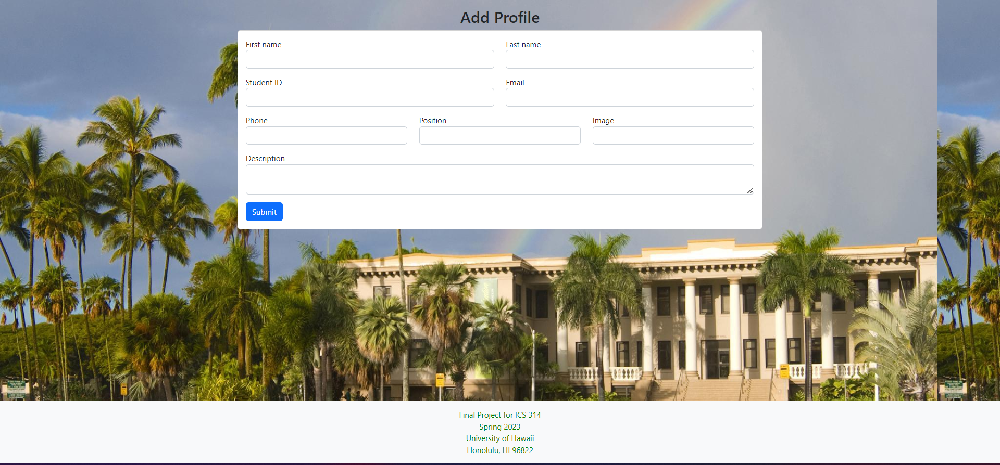
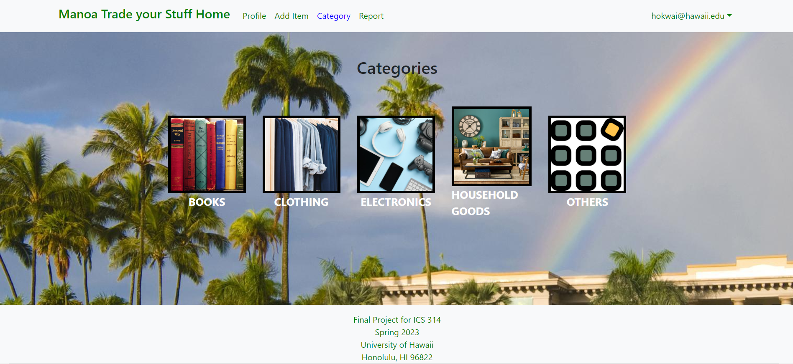
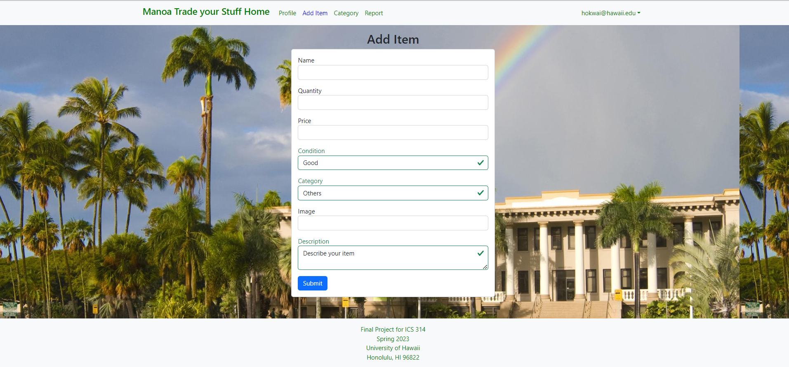
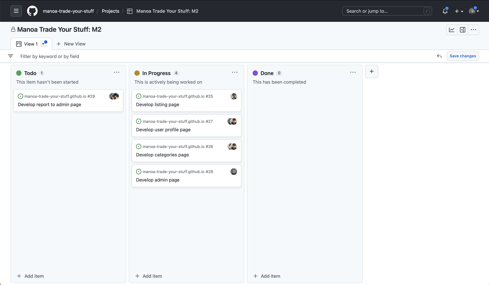
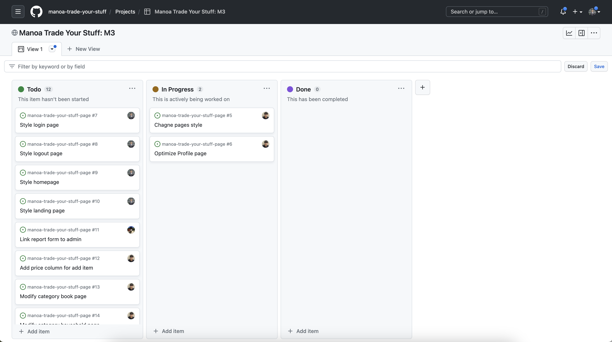

# Manoa Trade your Stuff

## Table of contents

* [Overview](#overview)
* [Mock-up Ideas](#mock-up-ideas)
* [Team](#team)
* [Developer Guide](#developer-guide)
* [Development History](#development-history)

## Overview
The goal of the project is to provide a marketplace where UHM students, faculty, and staff can buy and sell campus-specific goods and services in a convenient and efficient manner. The system should allow users to easily browse and search for items they need, as well as create listings for items they want to sell. It should also include features such as user profiles, categories for different types of items, notifications for new listings, and a mechanism for reporting inappropriate behavior. In addition to these basic features, advanced functionalities such as a rating system for buyers and sellers and a map-based interface to locate goods could be implemented to enhance the user experience. The end goal is to create a safe, user-friendly, and effective platform that helps UHM students better recycle and reuse campus-specific goods and services.

## Mock-up Ideas
  <li>Team</li>
  <li>Landing page</li>
  <li>Sign-in page</li>
  <li>Sign-up page</li>
  <li>Add Profile Page</li>
  <li>User home page</li>
  <li>Admin home page</li>
  <li>User Profile page</li>
  <li>Categories page</li>
  <li>Item List page</li>
  <li>Add item page</li>
  <li>Notify admin page</li>
  <li>Developer Guide</li>
  <li>Development History</li>
  <li>Community Feedback</li>
  
## Team

<a  href="https://docs.google.com/document/d/1DOvsdJkyUgxPniUr7G4ivfmBcsozXm4Yf86d5SVJ0kg/edit?usp=sharing">Team Contract Link</a>

## Landing Page
The landing page is the main page where any user will be welcomed when first entering the site. They will be welcomed with a welcome text and all they need to do is click on the login button on the navbar. Then they will be prompted to sign in or sign up.

## Sign-in Page
The sign-in page is where a returning user will go and all they need to do is input their email and password then hit submit. After that, they will be sent to their user home page.

## Sign-up Page
The sign-up page is where a new user will go and all they need to do is input their email and password then hit submit. After that, they will be sent to their user home page.

## Add Profile Page
The add profile page is a necessary step for first-time users to register and create their profile. It ensures that important information about the user is captured and stored in the system. Once created, users can modify their profile at any time to keep it up-to-date with their changing preferences, interests, or personal details.

## User home page
The user home page provides users with a personalized experience where it is unique for each user. The navbar on the user home page offers several options, including a profile tab where users can check information about their account, such as their personal information, purchase and sale history, and a bio about themselves. The list option allows users to view the items they have up for auction or sale. The categories tab helps users search for items by category which can be more efficient when finding what you are looking for quickly.

## Admin home page
The admin home page is similar to the normal user home page, but with a different navigation bar. Administrators are special users with additional privileges, allowing them to monitor user behavior within the system and create new categories or other functionality. The admin home page provides administrators with access to specific tools and features that regular users do not have, allowing them to better manage and improve the system. 

## User Profile Page
The user profile page is a personalized page that displays important information about a user, such as their student ID, name, email, phone number, and position. Users can easily edit their profile by clicking the "Edit Profile" button, which allows them to update their information as needed. The profile page displays the user's recent sales and purchases, giving them a quick and easy way to track their activity. The page includes an "About" section, where users can introduce themselves and provide additional information about their interests, hobbies, or other relevant details. This section provides a great opportunity for users to share more about themselves with their peers and build stronger connections within the community.

## Categories page
The categories page is a hub that organizes various items for sale into different categories, making it easy for users to browse and find what they're looking for. The page is divided into several categories, such as books, clothing and accessories, and electronics, each with its own sub-page. When users upload an item for sale, they can assign it to a specific category and provide all necessary details, such as the price and information about the item. This information is then displayed on the specific category page, allowing other users to easily browse and potentially purchase the item. 

## Item List page
The item list page serves as a hub for users to browse and search for items they are interested in. It is linked to the categories page, allowing users to easily filter and navigate to specific types of items. Upon selecting a category, the page displays a list of relevant items with key information such as the seller's details, pricing, and any other relevant details. This makes it easy for users to quickly find the items they are looking for and make informed purchase decisions.

## Add item page 
The list item page is a page where a user can add details and upload an image of the item that they want to sell or auction. There are three descriptions that the user must enter. The first is the Heading which is where the user will enter the name of the description of the item. The next is the condition and this is where the user will describe the condition of the product such as used, good, like new, and new. The next is a category and this is where a user will put the category that matches the item. This will make it easier to organize items based on their category. The user must also enter a photo of the item so that other users can know what it looks like.

## Notify Admin page
The notify admin page is a page where users can issue complaints. There are two components that need to be filled out. First, the user must enter the users that were involved in the incident. Secondly, the user must describe the whole situation in detail so that the admin can fully understand what the problem is and the best course of action to resolve the issue. After the user inputs all these components they enter a button that will submit it and will send it to the admin for inspection.

## Developer Guide
For developers who like to use our projects as template, here is instruction to get started:

1. Visit to out [Manoa Trade Your Stuff](https://github.com/manoa-trade-your-stuff/manoa-trade-your-stuff-page/tree/main) and click on green button it says 'code' to make clone application your local.
2. Use the terminal, change directory to app and inside app directory install meteor code: $ meteor npm install
3. After finish install meteor, it could run application by runs: $ meteor npm run start
4. It will gives link of application at http://localhost:3000

## Development History
<h4>Milestone 1: Mock up Development</h4>

<a  href="https://github.com/orgs/manoa-trade-your-stuff/projects/1/views/1?layout=board">M1 Project Link</a>

<h4>Milestone 2: Deployment</h4>

<a  href="https://github.com/orgs/manoa-trade-your-stuff/projects/3/views/1">M2 Project Link</a>

<h4>Milestone 3: </h4>

<a  href="https://github.com/orgs/manoa-trade-your-stuff/projects/4">M3 Project Link</a>

<a  href="https://manoatradeyourstuff.site/">Running App link</a>

## Community Feedback

1. Great! Definitely would use! Easy to navigate. Super easy and very functional. Spotless (Rylie Waldron, Communicology student)
  
2. Nice site, easy to use, add seller on report, make pics of categories uniform, very functional, easy to navigate, good look. (Lana Fukuda, Philosophy student)

3. Very easy to use and organized. Also very much needed for college students. Could use better for future for scams. Good. Easy to navigate. (Helly Sinclar, Biology student)
  
4. Very clean and easy to navigate across different tabs. A website that is very creative in which I would use for personal use. Good. Everything is symmetrically inlined with each other and visually appealing. (Bobby Roth, ICS student)

5. The website has great functionality. Very self explanatory, very easy to figure out how to use. The web design is very nice and simple. (Kristine Ordilla, ICS student)

