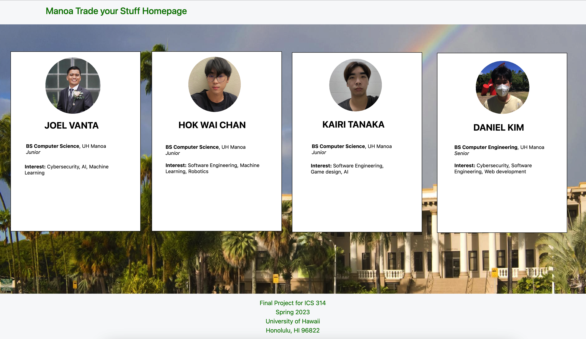
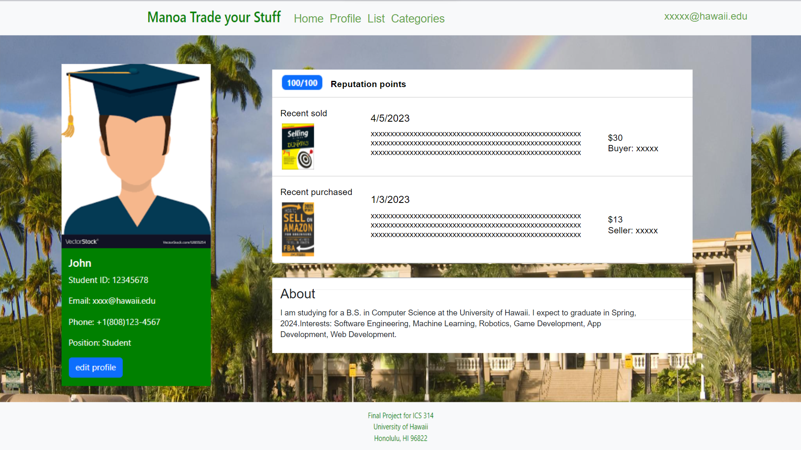
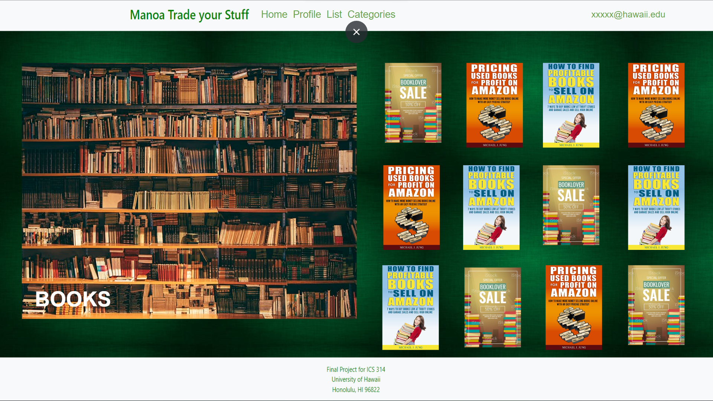
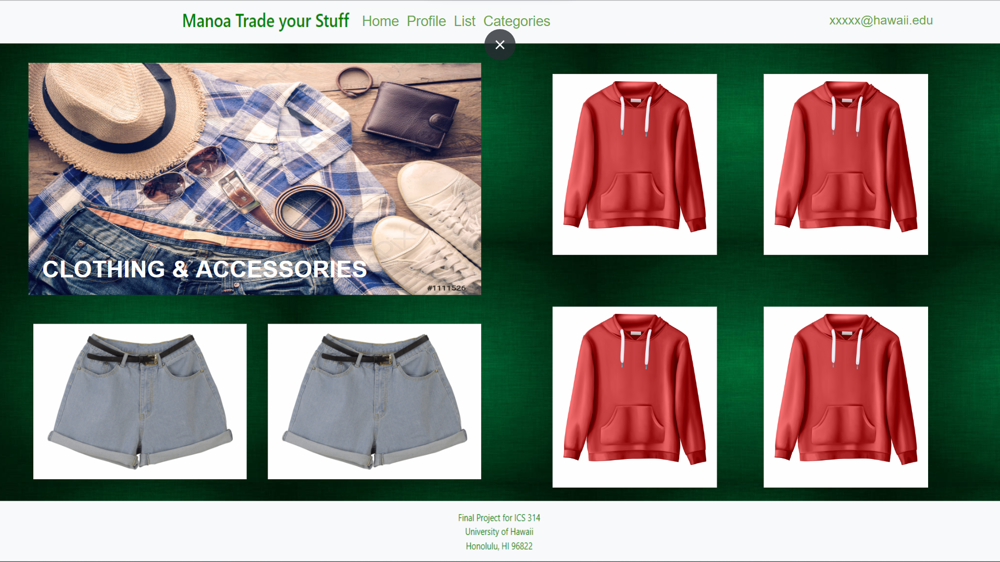
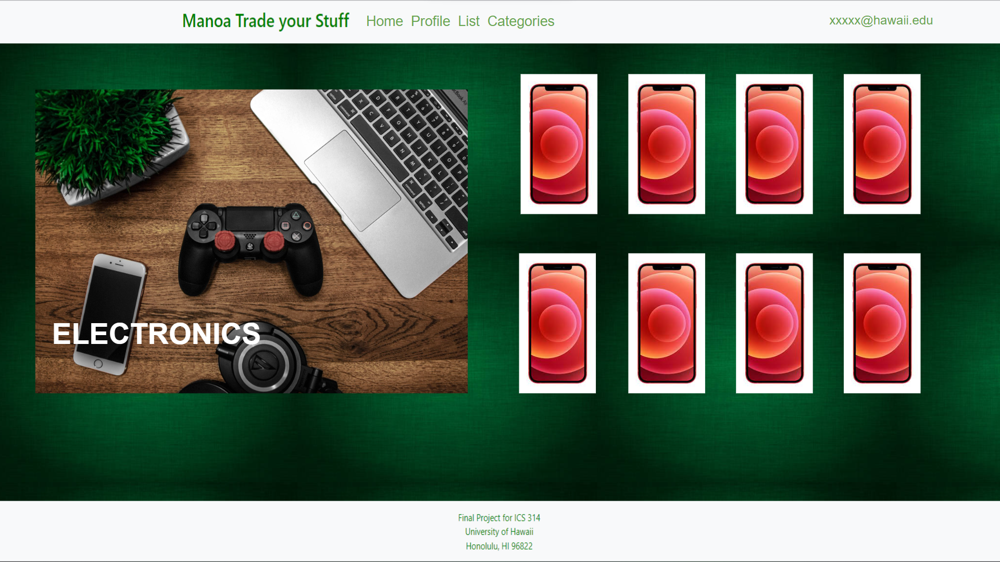
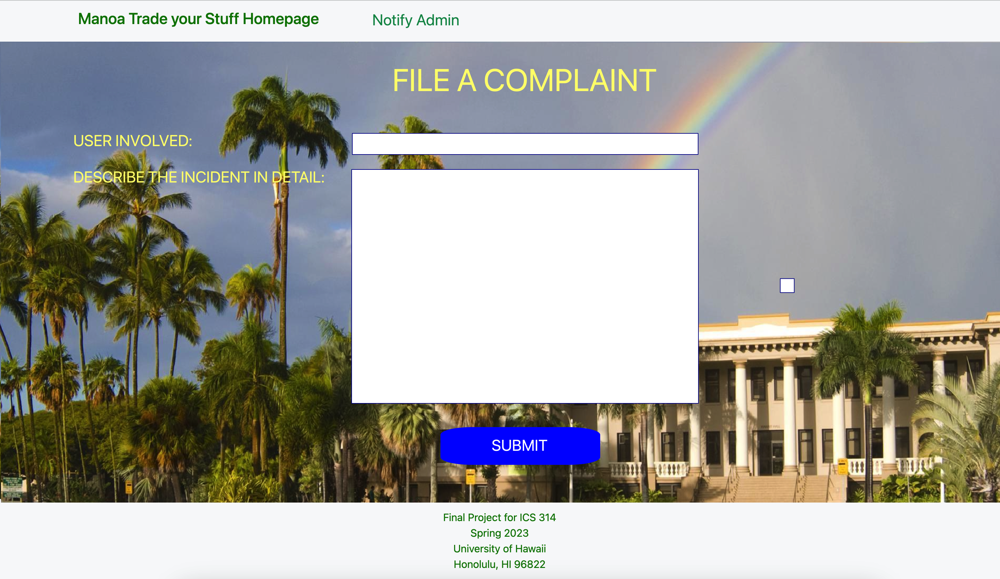
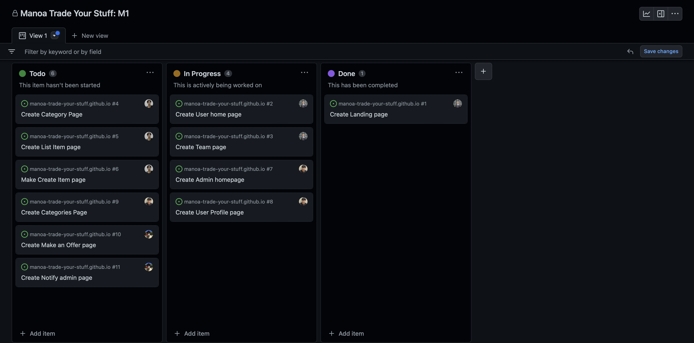

# Manoa Trade your Stuff

## Table of contents

* [Overview](#overview)
* [Mock-up Ideas](#mock-up-ideas)
* [Team](#team)
* [Development History](#development-history)

## Overview
The goal of the project is to provide a marketplace where UHM students, faculty, and staff can buy and sell campus-specific goods and services in a convenient and efficient manner. The system should allow users to easily browse and search for items they need, as well as create listings for items they want to sell. It should also include features such as user profiles, categories for different types of items, notifications for new listings, and a mechanism for reporting inappropriate behavior. In addition to these basic features, advanced functionalities such as a rating system for buyers and sellers and a map-based interface to locate goods could be implemented to enhance the user experience. The end goal is to create a safe, user-friendly, and effective platform that helps UHM students better recycle and reuse campus-specific goods and services.

## Mock-up Ideas
  <li>Landing page</li>
  <li>Sign-in page</li>
  <li>Sign-up page</li>
  <li>User home page</li>
  <li>Admin home page</li>
  <li>User Profile page</li>
  <li>Categories page</li>
  <li>Category page</li>
  <li>List Item page</li>
  <li>Create item page</li>
  <li>Make offer on item page</li>
  <li>Notify admin page</li>
  
## Team

<a  href="https://docs.google.com/document/d/1DOvsdJkyUgxPniUr7G4ivfmBcsozXm4Yf86d5SVJ0kg/edit?usp=sharing">Team Contract Link</a>

## Landing Page

## Sign-in Page

## Sign-up Page

## User home page

## Admin home page
The admin home page is similar to the normal user home page, but with a different navigation bar. Administrators are special users with additional privileges, allowing them to monitor user behavior within the system and create new categories or other functionality. The admin home page provides administrators with access to specific tools and features that regular users do not have, allowing them to better manage and improve the system. 

## User Profile Page
The user profile page is a personalized page that displays important information about a user, such as their student ID, name, email, phone number, and position. Users can easily edit their profile by clicking the "Edit Profile" button, which allows them to update their information as needed. The profile page displays the user's recent sales and purchases, giving them a quick and easy way to track their activity. The page includes an "About" section, where users can introduce themselves and provide additional information about their interests, hobbies, or other relevant details. This section provides a great opportunity for users to share more about themselves with their peers and build stronger connections within the community.

## Categories page
The categories page is a hub that organizes various items for sale into different categories, making it easy for users to browse and find what they're looking for. The page is divided into several categories, such as books, clothing and accessories, and electronics, each with its own sub-page. When users upload an item for sale, they can assign it to a specific category and provide all necessary details, such as the price and information about the item. This information is then displayed on the specific category page, allowing other users to easily browse and potentially purchase the item. 

## List an item page

## Make offer on item page

## Notify Admin page

## Development History
<h4>Milestone 1: Mock up Development</h4>

